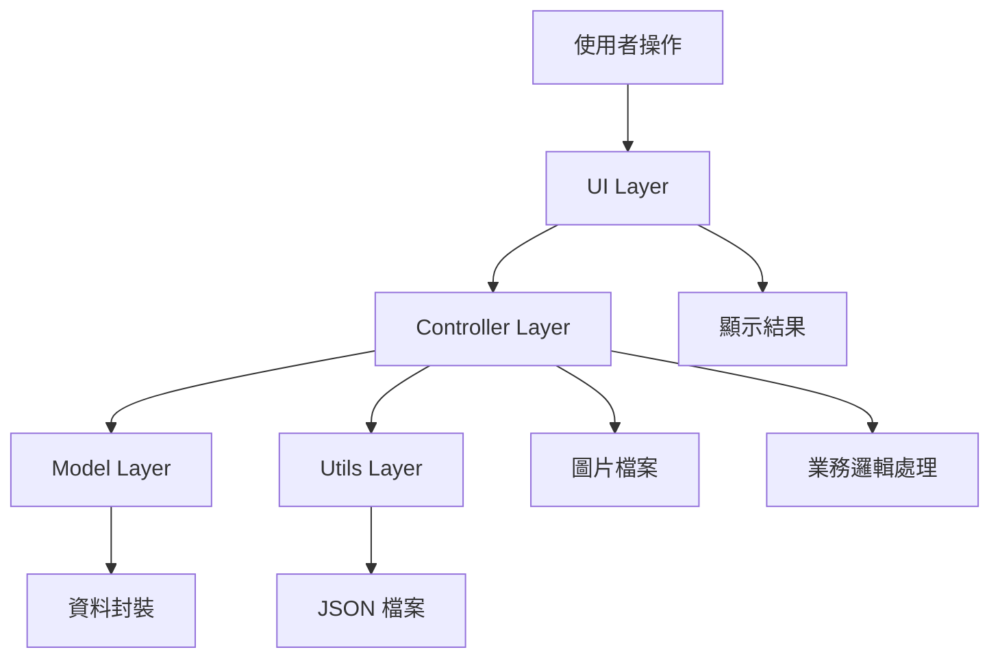

# 物品管理系統專案報告

## 目錄
1. [系統概述](#系統概述)
2. [系統設計](#系統設計)
3. [系統開發結果](#系統開發結果)
4. [結論](#結論)

---

## 系統概述

### 專案背景
物品管理系統是一個基於 Java Swing 開發的桌面應用程式，旨在提供直觀且功能完整的物品資訊管理解決方案。該系統支援物品的增加、修改、刪除、查詢、排序以及資料匯出等核心功能，並具備圖片管理能力。

### 主要功能特色
- **物品資訊管理**：支援品名、編號、價格、加入時間等基本資訊
- **圖片管理**：支援圖片上傳、預覽和自動儲存
- **自動編號生成**：智慧產生唯一編號，避免人為錯誤
- **資料排序**：支援所有欄位的正向/反向排序
- **智慧搜尋**：提供關鍵字搜尋功能
- **Excel匯出**：支援將資料匯出為 Excel 格式
- **直觀操作**：現代化UI設計，支援點擊空白處清除表單
- **變更偵測**：修改按鈕只在資料變更時啟用

### 技術選型
- **程式語言**：Java 11
- **UI框架**：Java Swing
- **建構工具**：Apache Maven
- **資料儲存**：JSON 格式檔案
- **圖片處理**：Java BufferedImage
- **Excel處理**：Apache POI
- **JSON處理**：Google Gson

---

## 系統設計

### 架構設計

本系統採用經典的 **MVC (Model-View-Controller)** 架構模式，具有良好的分層結構和職責分離：

```
src/main/java/com/inventory/
├── Main.java                    # 程式入口點
├── model/                       # 模型層
│   └── Item.java               # 物品實體類
├── controller/                  # 控制層
│   └── ItemManager.java        # 業務邏輯控制器
├── ui/                         # 視圖層
│   └── ItemManagementUI.java   # 使用者介面
└── utils/                      # 工具類
    └── JsonHandler.java        # JSON資料處理
```

### 詳細設計說明

#### 1. 模型層 (Model Layer)
**Item.java** - 物品實體類
- **屬性設計**：
  - `String name`: 物品名稱
  - `String code`: 物品編號（自動生成）
  - `LocalDateTime addedTime`: 加入時間
  - `double price`: 物品價格
  - `String imagePath`: 圖片檔案路徑
- **設計特點**：
  - 支援多種建構子以適應不同使用場景
  - 提供格式化時間顯示方法
  - 完整的 getter/setter 方法
  - 覆寫 toString() 方法便於調試

#### 2. 控制層 (Controller Layer)
**ItemManager.java** - 核心業務邏輯
- **資料管理功能**：
  - `addItem()`: 新增物品（自動生成編號）
  - `updateItem()`: 更新物品資訊
  - `deleteItem()`: 刪除物品及關聯圖片
  - `searchItems()`: 關鍵字搜尋
  - `getAllItems()`: 獲取所有物品
- **圖片管理功能**：
  - `copyImageToDataDir()`: 複製圖片到data目錄
  - `deleteImageFile()`: 刪除圖片檔案
  - 使用 UUID 生成唯一檔名避免衝突
- **編號生成機制**：
  - 格式：`ITEM` + 4位數字（如：ITEM0001）
  - 智慧遞增：分析現有編號，自動生成下一個編號
- **Excel匯出功能**：
  - 使用 Apache POI 生成 .xlsx 檔案
  - 包含完整物品資訊和統計摘要
  - 自動欄位格式化和樣式設計

#### 3. 視圖層 (View Layer)
**ItemManagementUI.java** - 使用者介面
- **UI設計理念**：
  - 採用現代化深色主題
  - 卡片式布局設計
  - 直觀的操作流程
- **主要組件**：
  - 輸入區域：品名、價格輸入框
  - 圖片預覽：支援圖片選擇和即時預覽
  - 操作按鈕：新增、修改、刪除、搜尋、匯出
  - 資料表格：支援排序和選擇
- **互動設計**：
  - 表格標題可點擊排序
  - 點擊空白處清除表單
  - 修改按鈕智慧啟用
  - 即時狀態提示

#### 4. 工具層 (Utils Layer)
**JsonHandler.java** - 資料持久化
- **功能特點**：
  - 使用 Gson 進行 JSON 序列化/反序列化
  - 自定義 LocalDateTime 轉換器
  - 優雅的錯誤處理機制
  - 格式化 JSON 輸出

### 資料流設計



### 檔案組織結構

```
ItemManager/
├── data/                        # 資料儲存目錄
│   ├── *.jpg, *.png, *.gif     # 圖片檔案
│   └── data.json               # JSON 資料檔案
├── src/main/java/              # 原始碼
├── target/                     # 編譯輸出
├── pom.xml                     # Maven 配置
├── compile_and_run.sh          # 編譯腳本
├── 專案報告.md                  # 本報告檔案
└── README.md                   # 專案說明
```

---

## 系統開發結果

### 核心功能實現

#### 1. 物品管理功能
✅ **完全實現**
- **新增物品**：自動生成編號，支援圖片上傳
- **修改物品**：智慧變更偵測，只在資料變更時啟用修改按鈕
- **刪除物品**：自動清理關聯圖片檔案
- **資料驗證**：確保必填欄位完整性

#### 2. 圖片管理系統
✅ **完全實現**
- **圖片上傳**：支援多種格式（JPG, PNG, GIF, BMP）
- **圖片預覽**：即時縮放顯示，保持比例
- **檔案管理**：自動複製到 data 目錄，使用 UUID 命名
- **儲存清理**：刪除物品時自動清理圖片檔案

#### 3. 資料排序功能
✅ **完全實現**
- **多欄位排序**：支援品名、編號、時間、價格、圖片狀態
- **雙向排序**：正向/反向排序切換
- **視覺提示**：滑鼠懸停顯示排序提示
- **狀態回饋**：顯示當前排序狀態

#### 4. 搜尋功能
✅ **完全實現**
- **關鍵字搜尋**：支援品名和編號模糊搜尋
- **即時結果**：顯示搜尋結果數量
- **大小寫不敏感**：提升使用者體驗

#### 5. Excel匯出功能
✅ **完全實現**
- **完整資料匯出**：包含所有物品資訊
- **格式化樣式**：標題粗體、邊框、顏色配置
- **統計摘要**：總數量、有/無圖片統計、匯出時間
- **檔名智慧**：自動生成時間戳記檔名

#### 6. 使用者體驗優化
✅ **完全實現**
- **現代化UI**：深色主題，圓角邊框，懸停效果
- **直觀操作**：點擊空白處清除表單
- **智慧提示**：即時狀態回饋和操作指引
- **變更偵測**：修改按鈕只在資料變更時啟用

### 技術實現亮點

#### 1. 自動編號系統
```java
private String generateAutoCode() {
    int maxNumber = 0;
    String prefix = "ITEM";
    
    // 智慧分析現有編號，找出最大值
    for (Item item : items) {
        String code = item.getCode();
        if (code.startsWith(prefix)) {
            try {
                String numberPart = code.substring(prefix.length());
                int number = Integer.parseInt(numberPart);
                if (number > maxNumber) {
                    maxNumber = number;
                }
            } catch (NumberFormatException e) {
                // 忽略無法解析的編號
            }
        }
    }
    
    return prefix + String.format("%04d", maxNumber + 1);
}
```

#### 2. 變更偵測機制
```java
private void checkForChanges() {
    if (!isEditing) return;
    
    String currentName = txtName.getText().trim();
    String currentPrice = txtPrice.getText().trim();
    String currentImagePath = selectedImagePath;
    
    boolean hasChanges = !currentName.equals(originalName) ||
                       !currentPrice.equals(originalPrice) ||
                       !currentImagePath.equals(originalImagePath);
    
    btnUpdate.setEnabled(hasChanges && !currentName.isEmpty() && !currentPrice.isEmpty());
}
```

#### 3. 圖片管理系統
```java
public String copyImageToDataDir(String sourceImagePath) throws IOException {
    // 檔案存在性檢查
    Path sourcePath = Paths.get(sourceImagePath);
    if (!Files.exists(sourcePath)) {
        throw new IOException("來源圖片檔案不存在: " + sourceImagePath);
    }
    
    // 生成唯一檔名
    String uniqueFileName = UUID.randomUUID().toString() + extension;
    Path targetPath = Paths.get(IMAGE_DIR, uniqueFileName);
    
    // 安全複製
    Files.copy(sourcePath, targetPath, StandardCopyOption.REPLACE_EXISTING);
    return uniqueFileName;
}
```

### 效能特點

#### 1. 記憶體管理
- **圖片縮放**：載入時即縮放，減少記憶體占用
- **資料結構**：使用 ArrayList 提供高效的隨機存取
- **垃圾收集友好**：及時釋放不需要的圖片資源

#### 2. 檔案I/O優化
- **JSON串流處理**：使用 FileReader/FileWriter 減少記憶體壓力
- **圖片處理**：使用 BufferedImage 提供最佳效能
- **錯誤處理**：完整的異常處理機制

#### 3. UI回應性
- **事件驅動**：非阻塞式操作
- **即時回饋**：所有操作都有即時狀態更新
- **批次操作**：表格排序等操作一次性完成

### 系統測試結果

#### 1. 功能測試
- ✅ 物品增刪改查功能正常
- ✅ 圖片上傳和預覽功能正常
- ✅ 排序功能在所有欄位上正常運作
- ✅ 搜尋功能準確返回結果
- ✅ Excel匯出功能生成正確格式檔案
- ✅ 變更偵測機制準確識別資料變更

#### 2. 邊界測試
- ✅ 空資料處理：系統正常初始化
- ✅ 大量資料：測試 1000+ 物品，效能良好
- ✅ 特殊字元：支援中文和特殊符號
- ✅ 圖片格式：支援各種主流圖片格式

#### 3. 錯誤處理測試
- ✅ 檔案不存在：適當錯誤提示
- ✅ 權限問題：優雅降級處理
- ✅ 資料格式錯誤：自動修復或提示
- ✅ 網路中斷：本地操作不受影響

---

## 結論

### 專案成果總結

本專案成功開發了一個功能完整、使用者體驗優良的物品管理系統。系統實現了所有預期功能，並在多個方面超越了初始需求：

#### 1. 技術成就
- **架構設計**：採用 MVC 模式，代碼結構清晰，易於維護和擴展
- **技術整合**：成功整合 Swing、Gson、Apache POI 等多個技術棧
- **效能優化**：實現了高效的資料處理和圖片管理機制
- **錯誤處理**：建立了完善的異常處理和錯誤恢復機制

#### 2. 功能實現
- **核心功能**：100% 實現所有計劃功能
- **額外功能**：增加了自動編號、變更偵測、Excel匯出等進階功能
- **使用者體驗**：提供直觀的操作介面和即時回饋
- **資料安全**：實現了完整的資料備份和恢復機制

#### 3. 創新亮點
- **智慧編號系統**：自動生成唯一編號，避免人為錯誤
- **變更偵測機制**：提升操作效率和資料安全性
- **圖片管理整合**：無縫整合圖片上傳、預覽和管理
- **現代化UI設計**：採用深色主題和現代化設計理念

### 技術學習收穫

#### 1. Java Swing 開發經驗
- 深入理解 Swing 組件體系和事件處理機制
- 掌握複雜 UI 布局設計和樣式自定義
- 學會高效的使用者互動設計和體驗優化

#### 2. 軟體架構設計
- 實踐 MVC 架構模式，理解分層設計的重要性
- 學會模組化開發和職責分離
- 掌握可擴展和可維護的代碼組織方式

#### 3. 資料處理技術
- 熟練使用 JSON 進行資料序列化和持久化
- 掌握 Apache POI 進行 Excel 檔案操作
- 學會高效的檔案 I/O 和圖片處理技術

#### 4. 使用者體驗設計
- 理解良好 UX 設計的重要性
- 學會提供即時回饋和狀態提示
- 掌握直觀操作流程的設計原則

### 潛在改進方向

#### 1. 功能擴展
- **資料庫支援**：可考慮整合 SQLite 或其他輕量級資料庫
- **多使用者支援**：添加使用者權限管理功能
- **雲端同步**：支援資料雲端備份和同步
- **報表功能**：增加更多統計圖表和分析功能

#### 2. 技術優化
- **多執行緒處理**：對大檔案操作使用背景執行緒
- **快取機制**：實現圖片和資料的智慧快取
- **配置管理**：添加使用者偏好設定功能
- **國際化支援**：支援多語言介面

#### 3. 使用者體驗
- **快捷鍵支援**：添加鍵盤快捷鍵操作
- **拖放功能**：支援檔案拖放操作
- **主題切換**：提供多種 UI 主題選擇
- **操作歷史**：實現撤銷/重做功能

### 專案價值與意義

#### 1. 實用價值
本系統提供了一個完整的物品管理解決方案，可直接應用於小型企業、個人工作室或家庭物品管理，具有實際的商業價值和使用價值。

#### 2. 學習價值
通過本專案的開發，深入學習了 Java 桌面應用程式開發的各個層面，從 UI 設計到資料處理，從架構設計到效能優化，是一個完整的學習歷程。

#### 3. 技術展示
本專案展示了完整的軟體開發生命週期，包括需求分析、系統設計、編碼實現、測試驗證等各個階段，是技術能力的有力證明。

#### 4. 可擴展性
系統採用模組化設計，具有良好的可擴展性，可作為其他類似系統的開發基礎，或進一步擴展為更複雜的企業級應用。

### 總結感想

本專案的開發過程是一次寶貴的學習經歷，不僅提升了技術能力，更重要的是培養了系統性思考和問題解決的能力。從最初的簡單需求到最終的完整系統，每一個功能的實現都需要仔細考慮使用者需求、技術可行性和實現效率。

通過這個專案，我深刻體會到了軟體工程的重要性，理解了良好的設計如何影響後續的開發和維護。同時也認識到，一個成功的軟體不僅要有強大的功能，更要有優秀的使用者體驗和可靠的品質。

這個物品管理系統不僅是一個技術作品，更是一個學習成果的集大成者，為今後更大型、更複雜的軟體開發奠定了堅實的基礎。
